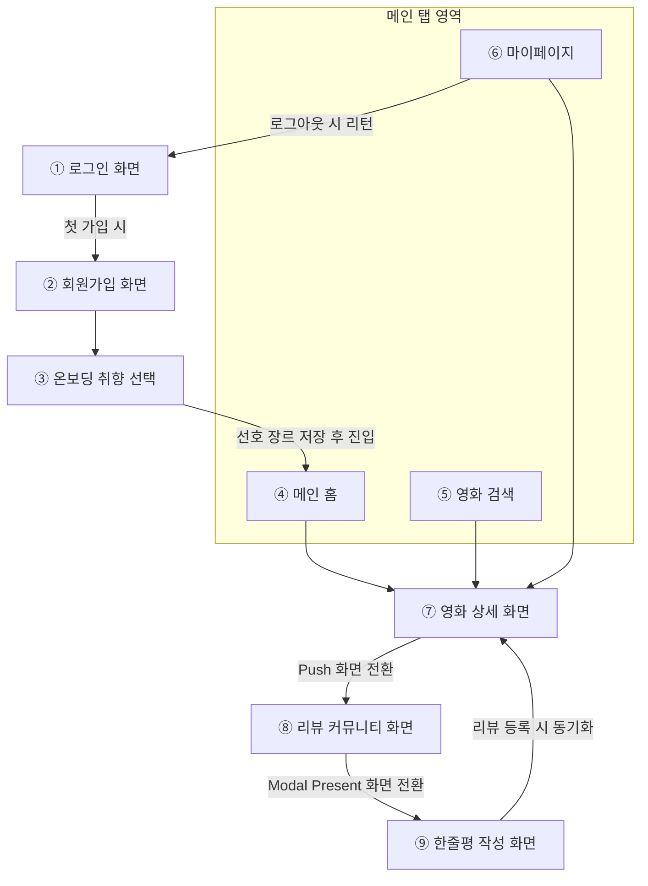

# MovieApp - Functional Specification

## 1. User Flow Diagram (유저 플로우)

---

## 2. 화면별 기능 및 API 연동 명세

### 로그인 화면 (Sign In View)

- **UI 구성 요소**
  - 이메일(ID) 및 비밀번호(PW) 입력 폼 (`UITextField`)
  - 로그인 실행 버튼 및 자동 로그인 체크박스
- **비즈니스 로직 및 API 연동 명세**
  1. 로그인 버튼 탭 시 `GET /3/authentication/token/new`를 호출하여 임시 인증 토큰(`request_token`)을 발급받습니다.
  2. 발급받은 토큰과 입력된 ID/PW를 파라미터로 포함하여 `POST /3/authentication/token/validate_with_login`을 호출, 유저 인증을 수행합니다.
  3. 인증 성공 시, `POST /3/authentication/session/new`를 호출하여 최종 `session_id`를 발급받고 이를 `UserDefaults`에 영구 저장합니다.
- **예외 처리 및 유효성 검사**
  - ID는 이메일 정규식 포맷을 충족해야 하며, PW는 8자리 이상인 경우에만 로그인 버튼이 활성화됩니다.
  - API 인증 실패 응답 수신 시, `UIAlertController`를 통해 에러 메시지를 얼럿으로 노출합니다.

### 회원가입 화면 (Sign Up View)

- **UI 구성 요소**
  - 이메일 입력 필드, 중복 확인 버튼, 패스워드 및 패스워드 확인 입력 필드
  - 이용약관 동의 체크박스 및 웹뷰 영역
- **비즈니스 로직 및 API 연동 명세**
  - 현재 단계에서는 외부 웹 페이지 링크 연동 또는 로컬의 가상 회원가입 성공 분기 로직으로 대체 처리합니다.
  - 가입 완료 프로세스 완료 시 알림 팝업 노출 후 로그인 화면으로 이전 (`Pop`) 처리합니다.

### 온보딩 취향 선택 화면 (Onboarding Preference View)

- **UI 구성 요소**
  - 영화 장르 목록을 표시하는 그리드 레이아웃 (`UICollectionView`)
  - 완료 및 다음 단계 이동 버튼
- **비즈니스 로직 및 API 연동 명세**
  - `GET /3/genre/movie/list` API를 호출하여 전체 영화 장르 ID와 국문 매핑 텍스트 데이터를 수신합니다.
  - 사용자가 최소 3개 이상의 장르를 선택한 경우에만 완료 버튼이 활성화되며, 선택된 장르 ID 배열(`[Int]`)은 로컬 전역 세션(Session)에 저장되어 메인 홈 화면의 초기 필터링 데이터로 전달됩니다.

### 메인 홈 화면 (Home Tab View)

- **UI 구성 요소**
  - **상단:** 현재 상영작 가로 스크롤 배너 영역 (`UICollectionView`)
  - **하단:** 인기 영화 및 최고 평점 섹션 세로 리스트 영역 (`UITableView`)
- **비즈니스 로직 및 API 연동 명세**
  - **상단 배너:** `GET /3/movie/now_playing` API를 연동하여 현재 상영 중인 영화의 포스터 가로 스크롤을 구현합니다.
  - **하단 리스트:** `GET /3/movie/popular` 및 `GET /3/movie/top_rated` API를 동시 호출하여 각 테이블뷰 섹션에 데이터를 매핑합니다.
  - **페이지네이션(Pagination):** 테이블뷰 스크롤이 바닥 영역(최대 콘텐츠 높이 부근)에 도달하는 시점을 감지하여 데이터 요청 `page` 번호를 1씩 증가시키며 연속 바인딩합니다. 데이터 중복 요청을 방지하기 위해 비동기 통신 상태 플래그(`isLoading`)를 통해 통제합니다.
  - **데이터 가공 로직:** 수신된 `genre_ids: [Int]` 데이터를 온보딩 단계에서 확보한 국문 장르 데이터와 대조하여 셀 내부에 국문 장르 배지(Badge) 텍스트로 치환 출력합니다. 날짜 데이터(`yyyy-MM-dd`)는 `DateFormatter`를 사용하여 `yyyy년 MM월 dd일 개봉` 포맷으로 변환합니다.

### 영화 검색 화면 (Search Tab View)

- **UI 구성 요소**
  - 상단 검색 바 (`UISearchBar`)
  - 최근 검색 기록 테이블뷰 및 전체 삭제 버튼
  - 검색 결과 표시 그리드 레이아웃
- **비즈니스 로직 및 API 연동 명세**
  - 사용자가 서치바에 텍스트를 입력할 때마다 `GET /3/search/movie` API에 검색어(`query`)를 파라미터로 실어 실시간 검색 수행합니다.
  - 검색이 완료된 키워드는 배열 형태의 로컬 데이터로 최대 10개까지 저장 및 관리됩니다.
- **예외 처리**
  - API 검색 결과가 0건인 경우, 결과 레이아웃을 숨기고 "검색 결과가 없습니다"라는 명세 텍스트가 포함된 `EmptyView`를 화면 중앙에 분기 노출합니다.

### 마이페이지 / 프로필 화면 (Profile Tab View)

- **UI 구성 요소**
  - 사용자 프로필 이미지뷰 및 닉네임 표시 라벨
  - '내가 찜한 영화 목록' 세로 리스트 (`UITableView`)
  - 로그아웃 실행 버튼
- **비즈니스 로직 및 API 연동 명세**
  - `UserDefaults`에 저장된 `session_id`를 기반으로 `GET /3/account`를 호출하여 현재 로그인한 사용자의 고유 계정 정보(`account_id`, `username`)를 확인합니다.
  - 수신된 `account_id`를 사용하여 `GET /3/account/{account_id}/favorite/movies` API를 호출, 사용자가 서버상에서 즐겨찾기 등록을 수행한 영화 목록을 실시간으로 동기화하여 출력합니다.
  - 로그아웃 버튼 터치 시 로컬의 세션 데이터를 파기하고, 애플리케이션의 루트 뷰컨트롤러(`Root ViewController`)를 로그인 화면으로 초기화 및 전환 처리합니다.

### 영화 상세 화면 (Detail View)

- **UI 구성 요소**
  - 상단 가로형 백드롭 이미지뷰 및 전면 세로형 포스터 이미지뷰
  - 영화 제목, 평점, 러닝타임, 한글 장르 배지 스택 레이아웃
  - 즐겨찾기(하트) 등록 및 해제 버튼
  - 공식 예고편 재생 웹뷰 영역 (`WKWebView`)
  - 줄거리 텍스트 표시 영역 및 추천 영화 목록 가로 컬렉션뷰
- **비즈니스 로직 및 API 연동 명세**
  - 이전 화면으로부터 인입된 영화의 고유 ID(`movie_id`)를 주입받아 동작합니다.
  - **상세 정보:** `GET /3/movie/{movie_id}`를 호출하여 영화의 러닝타임, 국문 상세 정보, 평점 데이터를 매핑합니다.
  - **공식 예고편 연동:** `GET /3/movie/{movie_id}/videos` API를 호출하여 비디오 결과셋 중 공식 트레일러의 유튜브 키(`key`)를 추출합니다. 내부 웹뷰 컴포넌트에 `https://www.youtube.com/embed/\(key)` 경로를 바인딩하여 인라인 동영상 재생을 구현합니다.
  - **추천 유사작:** `GET /3/movie/{movie_id}/recommendations` API로 획득한 추천 영화 리스트를 하단 가로 스크롤 데이터 소스에 매핑합니다.
  - **동적 높이 구현:** 줄거리 텍스트의 길이에 맞춰 전체 레이아웃이 유동적으로 스크롤되도록 최상위 수직 `UIScrollView` 내부에 동적 오토레이아웃 제약조건(`Constraints`)을 수립합니다.
  - **즐겨찾기 상태 변경:** 하트 버튼 클릭 시 `POST /3/account/{account_id}/favorite` API를 트리거하여 서버의 유저 즐겨찾기 목록 데이터를 실시간으로 추가 또는 삭제 처리합니다.

### 리뷰 리스트 및 커뮤니티 화면 (Review Board View)

- **UI 구성 요소**
  - 해당 영화의 총 리뷰 개수 표시 라벨
  - 글로벌 리뷰어 네임, 작성 일자, 리뷰 본문 텍스트를 포함하는 세로 테이블뷰
  - 화면 우측 하단 플로팅 스타일의 '리뷰 작성' 버튼
- **비즈니스 로직 및 API 연동 명세**
  - `GET /3/movie/{movie_id}/reviews` API를 호출하여 TMDB 글로벌 사용자들이 등록한 실제 피드 데이터를 수신하여 리스트에 매핑합니다.
  - 리뷰 본문 텍스트의 글자 수 및 라인 수에 대응하여 테이블뷰 셀의 높이가 동적으로 연산되도록 `UITableView.automaticDimension` 속성을 적용합니다.

### 한줄평 / 별점 작성 화면 (Review Write Presentation View)

- **UI 구성 요소**
  - 아래에서 위로 프레젠테이션되는 모달 스타일 레이아웃 (`UIPresentationController` 기반)
  - 별점 조절 입력 슬라이더 (0.5점 ~ 10.0점 제어 범위)
  - 리뷰 텍스트 에디터 컴포넌트 및 최종 등록 버튼
- **비즈니스 로직 및 API 연동 명세**
  - 사용자가 평점 및 텍스트 입력을 완료하고 등록 버튼을 누르면 `POST /3/movie/{movie_id}/rating` API를 트리거하여 사용자가 매긴 점수 값을 TMDB 서버로 전송 및 영구 기록합니다.
- **화면 간 데이터 동기화 기준**
  - 서버 등록 성공 응답(`status_code: 1` 또는 `12`)을 수신하는 즉시 해당 모달 화면을 닫음(`Dismiss`) 처리합니다. 이와 동시에 부모 계층 화면인 영화 상세 화면의 전체 평점 데이터와 리뷰 리스트 테이블뷰의 데이터 소스를 즉시 새로고침(`reloadData`)하여 최신 상태 유지를 보장합니다.

---

## 3. 미디어 자원 요청 및 이미지 캐싱 정책

- **이미지 요청 Base URL 주소:** `https://image.tmdb.org/t/p/`
- **해상도 및 규격 분기 지침**
  - 일반 리스트 썸네일 포스터: `w200` 경로 지정
  - 상세 정보 메인 포스터: `w500` 경로 지정
  - 상세 화면 배경 백드롭 이미지: `original` 경로 지정
- **비동기 다운로드 처리**
  - 각 이미지 경로를 조합하여 비동기 `URLSession.shared.dataTask`를 통해 메모리로 다운로드한 후 `UIImage` 객체로 변환하여 뷰에 매핑합니다.
  - Phase 1 단계에서는 외부 서드파티 라이브러리(Kingfisher 등)의 사용을 금지하며, 오직 원시 시스템 API 레벨에서 비동기 처리 및 셀 재사용 시 이미지 매핑 왜곡 현상을 방지하는 예외 처리를 직접 구현합니다.
